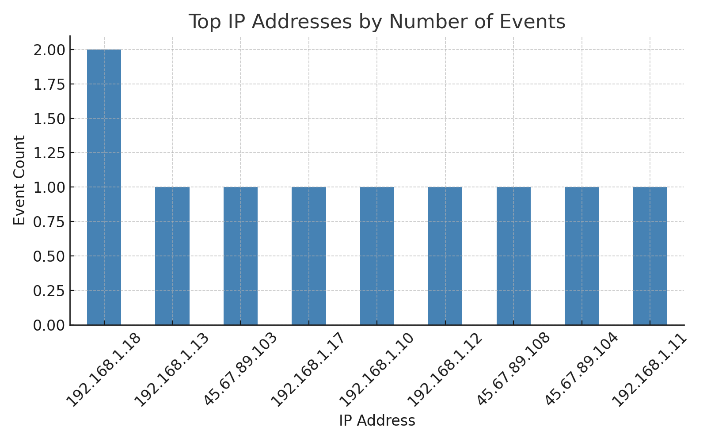
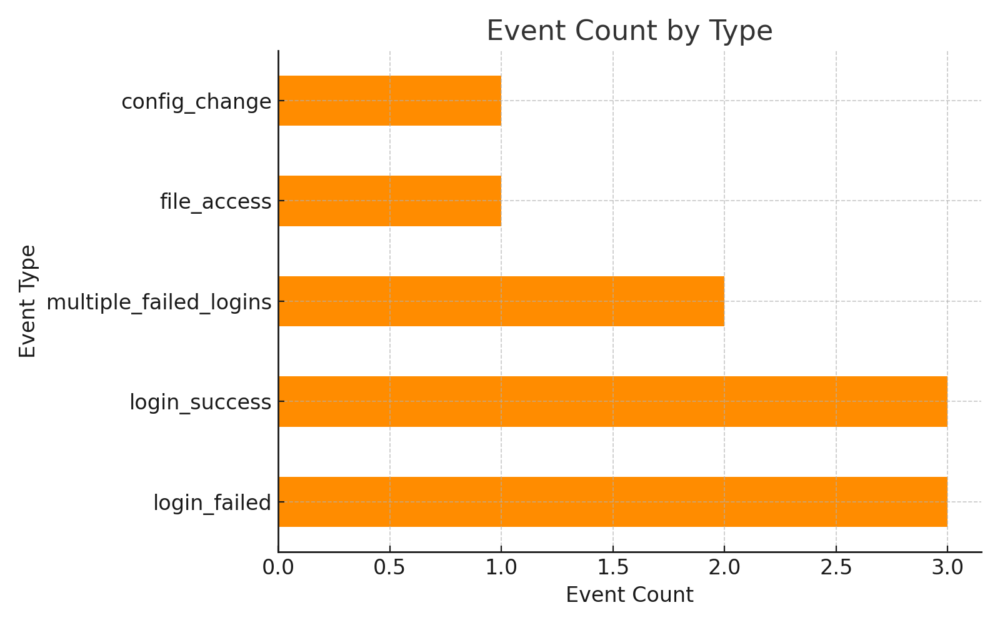

# 🛡️ CyberRisk-Lab

## 🧠 About this Project

> “Man doesn't choose to evolve — evolution arrives, and we must find her.”

Mexico is a growing country. Its companies are expanding fast — often faster than their digital maturity. In this rush, many overlook basic cybersecurity practices. For example, using WhatsApp for operational coordination without two-factor authentication is already a vulnerability.

Coming from a background in mechanical work and physical security, I’ve seen how people protect assets with firearms — like in the good old days. But no gun can defend against a phishing campaign, exposed ports, or poor password hygiene. Even the security company I worked with had serious digital gaps.

As I transitioned into cybersecurity, I requested permission to implement basic protective measures. This allowed me to apply my growing knowledge in a real-world setting while contributing to the safety of an outdated infrastructure.

This repository is the result of that journey — a simulated, anonymized, and professional cybersecurity lab.

---

## 🎯 Objectives

- Simulate a cybersecurity audit using public data and open standards.
- Apply real-world risk assessment and reporting methodologies.
- Practice Blue Team techniques: detection, prevention, and documentation.
- Create a technical portfolio to demonstrate my professional skills.

---

## 🛠️ Tools & Methodologies

- **MITRE ATT&CK Framework**
- **ISO/IEC 27005** risk analysis principles
- **NIST NVD CVE Feeds**
- **CICIDS 2017** intrusion detection dataset (for enrichment)
- **Python** for log generation and data parsing
- **Excel** for risk registers and impact maps
- **Markdown** for professional reporting

---

## 🔎 Risk Management

### ✅ [Risk Register](./risks/risk_register_summary.csv)

A list of simulated vulnerabilities with descriptions, impact levels, and suggested mitigations — aligned to basic threat modeling practices.

### 🗺️ Risk Cartography

A visual representation of risks based on ISO 27005: likelihood × impact matrix.

---

## 🐍 CVE Parsing Tool

### [`scripts/cve_parser.py`](./scripts/cve_parser.py)

This script connects to the NIST NVD API and fetches CVE data for a specific year. It filters vulnerabilities by relevance (e.g., authentication, network, encryption) and exports them for analysis.

- 📥 Output: `cves_filtered_2023.csv`
- 🧠 Use: Populate risk registers or threat intel dashboards

---

## 📈 Simulated Event Logs

### [`scripts/log_simulator.py`](./scripts/log_simulator.py)

A Python script to generate synthetic log events, including:

- Successful and failed logins
- Multiple failed attempts (brute-force patterns)
- Configuration changes
- File access and remote activity

🗃️ Output file: [`/datasets/simulated_logs.csv`](./datasets/simulated_logs.csv)

---

## 📊 Visualizations

### 🔹 Event Frequency by IP

Shows which IP addresses generated the most events (internal and external).

### 🔸 Event Types Summary

Breakdown of total events by category (login_failed, config_change, etc.).

---

## 📝 Incident Reports

- [🔎 Unauthorized Access Attempt – July 2025](./reports/incident_report.md)

A sample report based on simulated log data, documenting detection, impact, response, and recommendations.

---

## 🧾 Notes

This repository uses public data and simulated environments for learning and demonstration purposes. No real system or organization is exposed.

---

Created and maintained by [Carlos Joseph Guagnelli Villagrán](https://github.com/GuagnelliData) — aspiring Blue Teamer and cybersecurity consultant.

This project is not meant to stay static.

### 🚀 Roadmap

Over time, this repository will evolve as a **living archive of practical security techniques** that I apply, simulate, or recommend for growing companies — especially in Mexico and Latin America.

The goal is to help businesses:
- Understand the digital risks they face
- Adapt quickly with practical solutions
- Develop security culture before they become targets

If you're a small or mid-sized company and want to protect your digital assets, this project shows how I think, how I work — and how I can help.

> 🛡️ *Cybersecurity should be proactive, not reactive.*

---

