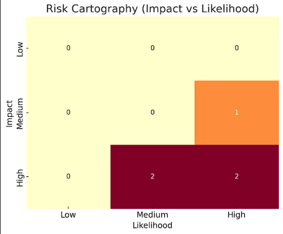

# CyberRisk-Lab

## 🧠 About this project

> “Man doesn't choose to evolve — evolution arrives, and we must find her.”

Mexico is a growing country. Its companies are growing too — some of them faster than they can adapt. And sometimes, in that rush, they forget basic digital hygiene. For example, using WhatsApp for critical communication without two-step verification is already a vulnerability for a modern Mexican company.

From my background in mechanical work and physical security, I saw that people often protect their assets with firearms — like in the good old days. But no gun can defend against cyberattacks. Even security companies, like the one I used to work for, had hidden digital vulnerabilities.

As I began my journey in cybersecurity, I asked for permission to apply some basic security measures (listed in this repository). My intention was to protect the company and, at the same time, learn how to apply real-world security strategies.

This repository contains the risk assessments, reports, and visualizations I created based on public datasets and best practices. It is built entirely for educational and professional purposes — and does not include any private or sensitive data.

## 🎯 Objectives

- Simulate a cybersecurity audit using real-world standards and open data.
- Apply risk management techniques to legacy-style infrastructure.
- Practice blue team methodologies: detection, prevention, reporting.
- Create professional-grade documentation for interview and portfolio use.

## 🛠 Tools & Methodologies

- MITRE ATT&CK Framework
- NIST NVD CVE Feeds
- CICIDS 2017 Intrusion Detection Dataset
- Sysmon and Windows logs (SwiftOnSecurity config)
- Python for data parsing and log generation
- Excel for risk register and cartography
- Markdown and PDF export for reporting

## 🔎 Risk Register

You can find the initial simulated vulnerabilities and risk mitigation suggestions in:
[Risk Register](./risks/risk_register_summary.csv)
## 🗺️ Risk Cartography

To visualize the simulated risks, we created a basic impact-likelihood matrix based on ISO 27005 methodology:

 

### 🐍 `cve_parser.py`

This script connects to the NVD (National Vulnerability Database) public API and downloads CVE data for a specified year. It filters vulnerabilities by relevant cybersecurity keywords (e.g., "authentication", "network", "encryption") and extracts metadata like severity, attack vector, and description.

The output is saved as a `.csv` file for further analysis and can be used to populate a risk register or generate visualizations.

**Use case**: Supporting the identification of high-impact threats as part of a simulated ISMS risk analysis.

## 📈 Simulated Event Logs

To support blue team exercises and demonstrate event monitoring, this project includes a custom script that generates synthetic security logs.

### 🐍 `scripts/log_simulator.py`
This Python script simulates events such as:
- Successful and failed logins
- Configuration changes
- Suspicious patterns like multiple failed login attempts
- Network scan detection

It outputs a file `simulated_logs.csv` (found in the `datasets/` folder) with 200 entries using randomized internal and external IPs, usernames, and timestamps.

This log data can be used for:
- Practicing incident response workflows
- Simulating SIEM-like detection
- Building dashboards and alerts

## 🧪 Simulated Log Dataset

This project includes a synthetic dataset of 10 event logs generated using a custom script.
These logs include successful and failed logins, config changes, and multiple failed login attempts.

You can find the file here:
[`/datasets/simulated_logs.csv`](./datasets/simulated_logs.csv)

